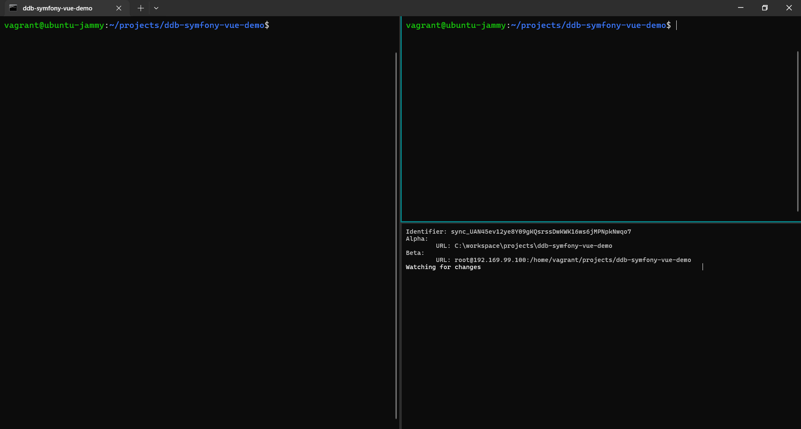
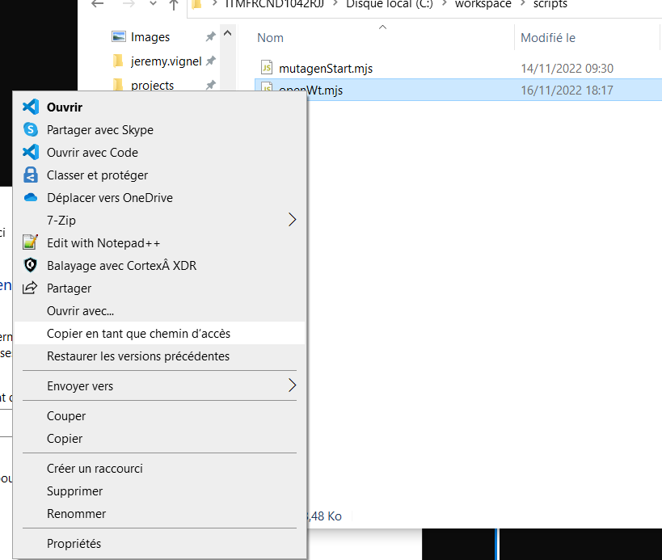
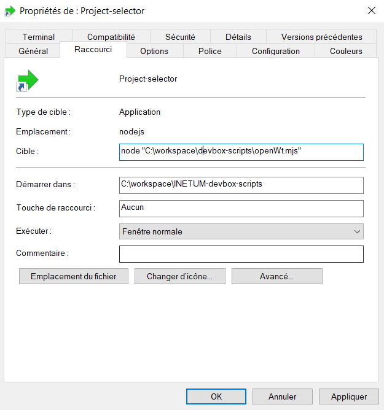
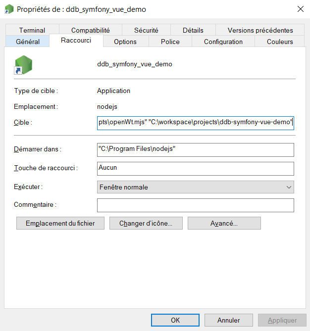
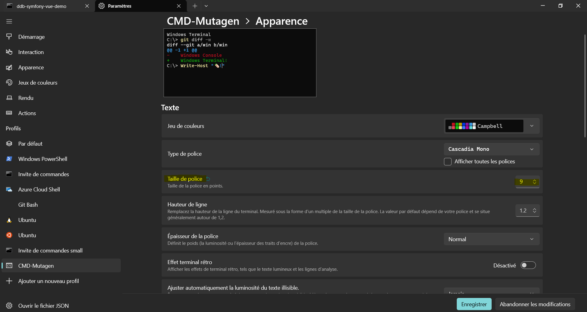
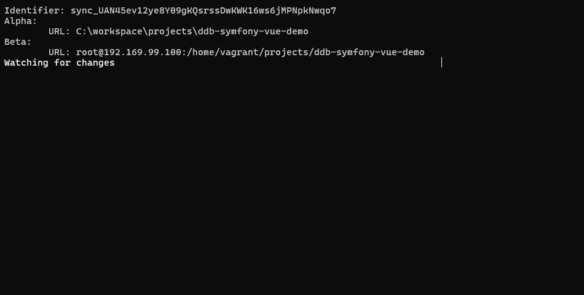
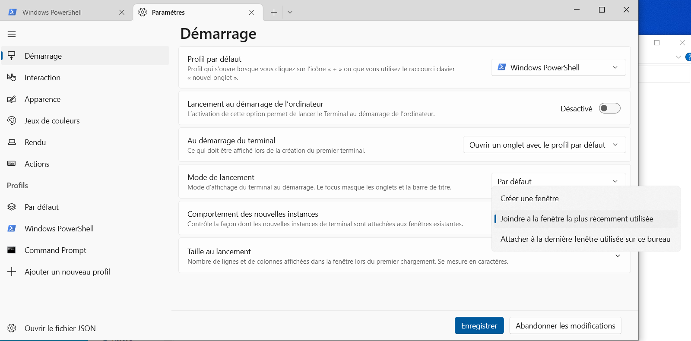

# Introduction
Le démarrage des projets avec la devbox nécessite de lancer plusieurs commandes, traditionnellement :

- `vagrant up` pour lancer la machine virtuelle qui contient le ddb
- `vagrant ssh`, suivi d'une navigation vers le répertoire du projet, et la commande qui permet de lancer le "watch" du projet (par exemple `make watch`)
- ouverture d'un autre terminal pour lancer des commandes sur le projet, comme les `composer require ...` et autres `npm install`
- ouverture d'un terminal pour lancer `mutagen sync monitor <sync id>` pour voir l'état de synchronisation.

Les scripts node.js de ce repository permettent de lancer toutes ces commandes rapidement afin d'optimiser le lancement d'un projet de la devbox. Il est également possible de lancer ces scripts sous la forme de raccourcis windows afin de pouvoir démarrer n'importe quel projet en deux clics sous cette forme :

# 1. Pré-requis

- La Devbox avec Vagrant+Virtualbox doit déjà être configurée sur votre poste, selon la procédure donnée dans le readme de [docker-devbox-vagrant](https://github.com/inetum-orleans/docker-devbox-vagrant/tree/master).
- Avoir installé node.js sur votre Windows
- Avoir installé [Windows Terminal](https://apps.microsoft.com/store/detail/windows-terminal/9N0DX20HK701?hl=fr-fr&gl=FR)
- Avoir installé OpenSSH Client 

# 2. Installation

Rendez vous dans votre workspace, par exemple `C:\workspace` puis lancer les commandes suivantes (depuis un git bash, sinon la dernière commande ne passe pas):

```
git clone git@github.com:inetum-orleans/devbox-scripts.git OU git clone https://github.com/inetum-orleans/devbox-scripts.git
cd devbox-scripts
echo "export {}" > variables.mjs
```

NOTE: si vous utilisez un cmd ou powershell, la dernière commande va créer le fichier en UTF-16, il faut le convertir en UTF-8 pour que le script fonctionne correctement. C'est plus simple de créer le fichier à la main et de mettre `export {}` dedans.

## Paramétrage

Il est possible de surcharger les variables exposées du fichier `variables.default.mjs` dans le fichier `variables.mjs`.

Exemple de fichier `variables.mjs` (pour résoudre le problème de défilement, voir "Problèmes connus" ci-dessous:
```js
// Pour le profil 3, il est fortement recommandé de créer un nouveau profil avec une taille de police réduite (<=9) pour que le texte ne défile pas sur un petit écran.
const profile3 = 'small cmd'
export {
    profile3,
}
```

# 3. Création d'un raccourci sur le bureau
Vous avez la possibilité de créer un raccourci en mode "sélecteur de projet" ou alors de faire un raccourci par projet.

Afin de créer un raccourci vers le sélecteur de projet, copiez le chemin d'accès du fichier `openWt.mjs` en faisant SHIFT + clic droit sur le fichier > copier en tant que chemin d'accès.

Ensuite, créez un raccourci, où désiré, avec comme cible `node` suivi du chemin copié précédemment en argument, comme ceci :

```
node "C:\workspace\devbox-scripts\openWt.mjs"
```


Il ne reste plus qu'à saisir un nom pour votre raccourci.

## 3.2 Création d'un raccourci spécifique par projet

Même procédure que pour le générique, mais il faut ajouter le chemin vers le répertoire du projet voulu en second argument comme ceci :

```
node "C:\workspace\devbox-scripts\openWt.mjs" "C:\workspace\projects\NOM_DU_PROJET"
```



De la  même manière que pour le project-selector, il faut saisir un nom pour votre raccourci et valider.

**Options possibles pour le raccourci :** 
- Changer la couleur de l'onglet
```
node "C:\workspace\devbox-scripts\openWt.mjs" --color "#40FF75" "C:\workspace\projects\NOM_DU_PROJET"
```
- Avoir un quatrième terminal
```
node "C:\workspace\devbox-scripts\openWt.mjs" --4-terminals "C:\workspace\projects\NOM_DU_PROJET"
```

Windows utilise par défaut le logo de node.js. Vous pouvez le changer en faisant clic droit > "propriétés" et en définissant une nouvelle icône au format .ico.


# Problèmes connus

## La console contenant le mutagen `mutagen sync monitor` défile beaucoup :
Le problème semble venir de la résolution d'écran, car si le windows terminal est déplacé sur un écran externe, le problème disparaît. Vous pouvez créer un profil spécifique au terminal dédié à mutagen et réduire la taille de la police de ce profil à 9 afin de ne plus avoir le problème.

Une fois le profil créé, il est nécessaire de surcharger la variable `profile3` concernée dans le fichier variables.mjs avec le bon nom de profil.
Voici le résultat :


## Le raccourci ouvre une nouvelle fenêtre windows terminal, je voudrais tout avoir en onglets :
C'est possible, c'est juste de la configuration de Windows Terminal. Il faut sélectionner "Joindre à la fenêtre la plus récemment utilisée".

## 'ssh' n'est pas reconnu en tant que commande interne ou externe :

Il faut installer OpenSSH Client sur Windows. Pour cela, ouvrez un Powershell en tant qu'administrateur et tapez la commande suivante :
```powershell
Get-WindowsCapability -Online | Where-Object Name -like 'OpenSSH*'
```

Le retour devrait être :
```
Name  : OpenSSH.Client~~~~0.0.1.0
State : NotPresent

Name  : OpenSSH.Server~~~~0.0.1.0
State : NotPresent
```

Alors lancer la commande suivante :
```powershell
Add-WindowsCapability -Online -Name OpenSSH.Client~~~~0.0.1.0
```
Le retour devrait être :
```
Path          :
Online        : True
RestartNeeded : False
```

voir la documentation officielle: [OpenSSH sur Windows](https://docs.microsoft.com/fr-fr/windows-server/administration/openssh/openssh_install_firstuse)

## Erreur lors de la récupération de la liste des synchronisations, avez-vous une version de mutagen >= 0.15 installée ? :
Si vous avez cette erreur c'est que votre version de mutagen n'est pas suffisament à jour.
<br/>
Pour mettre à jour mutagen, télécharger la dernière version stable sur [Télécharger Mutagen pour Windows x386](https://github.com/mutagen-io/mutagen/releases).

Couper mutagen depuis un terminal sous windows avec la commande suivante :
```
mutagen daemon stop
```
Extraire le contenu de l'archive téléchargée dans c:\workspace\mutagen (ou un autre répertoire si vous avez mutagen ailleurs)

Puis relancer mutagen
```
mutagen daemon start
```